# Wazuh SOC Homelab

A full-stack cybersecurity homelab built using Wazuh, Suricata, Fail2Ban, Kali Linux, Ubuntu Server, and a custom Python detection engine.

This project simulates real-world attack scenarios including reconnaissance, brute-force attacks, intrusion detection, automated alerting, incident investigation, and threat response within a controlled lab environment.

---

## Project Objectives

This lab was designed to:

* Build a Security Operations Center (SOC) environment from scratch
* Monitor and analyze security events
* Simulate common cyber attacks
* Develop custom detection logic
* Automate alerting and response workflows
* Gain hands-on experience with SIEM and IDS technologies

---

## Architecture


### Environment

| System          | Role                    |
| --------------- | ----------------------- |
| Kali Linux      | Attacker                |
| Ubuntu Server   | Target System           |
| Wazuh Manager   | SIEM Platform           |
| Wazuh Agent     | Log Collection          |
| Suricata        | Network IDS             |
| Fail2Ban        | Automated Response      |
| Python Detector | Custom Threat Detection |
| Discord Webhook | Alert Notifications     |

---

## Features

### Security Monitoring

* Centralized log collection with Wazuh
* Real-time security event monitoring
* Endpoint visibility through Wazuh Agent

### Intrusion Detection

* Network-based detection using Suricata IDS
* Nmap reconnaissance detection
* Alert forwarding to Wazuh

### Custom Detection Engineering

* Real-time SSH log monitoring
* Detection of successful brute-force attacks
* JSON alert generation
* Duplicate alert prevention

### Alerting

* Discord webhook integration
* Automated security notifications
* Structured alert output

### Automated Response

* Fail2Ban integration
* Automatic IP blocking
* SSH brute-force mitigation

---

# Attack Scenarios

## Phase 1 - Environment Deployment

Configured a virtual SOC environment using:

* VirtualBox
* Ubuntu Server
* Kali Linux
* Wazuh

### Evidence

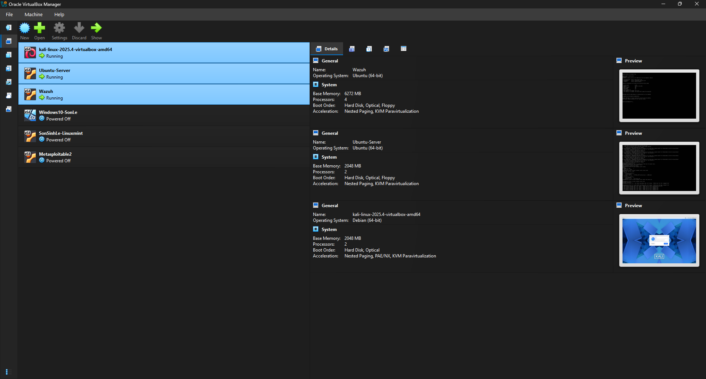

---

## Phase 2 - Wazuh Agent Enrollment

Connected the Ubuntu endpoint to the Wazuh Manager.

### Evidence

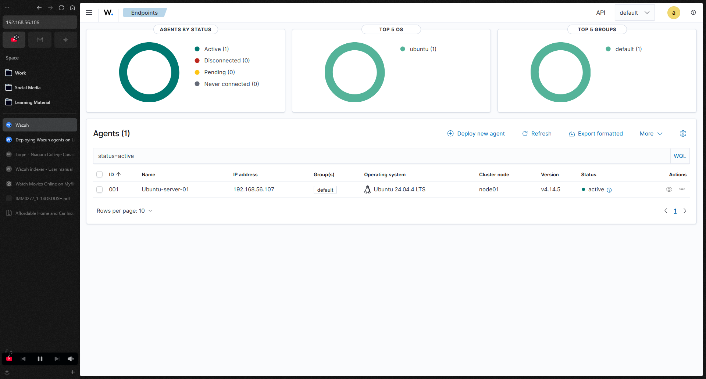

---

## Phase 3 - Log Collection Validation

Verified successful ingestion of authentication logs from Ubuntu Server.

Collected events:

* SSH login attempts
* Failed authentications
* Sudo activity

### Evidence

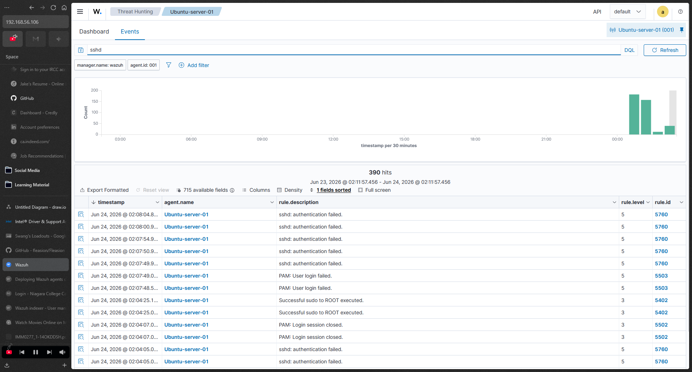

---

## Phase 4 - Reconnaissance Detection

Simulated reconnaissance activity using Nmap.

Example:

```bash
nmap -sV <target-ip>
```

Detection:

* Suricata generated scan alerts
* Events forwarded to Wazuh

### Evidence

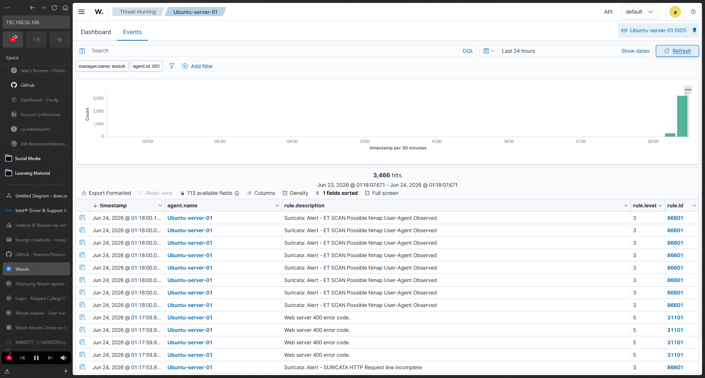

---

## Phase 5 - SSH Brute Force Attack

Simulated credential attacks using repeated failed SSH logins and Hydra.

Example:

```bash
hydra -l username -P passwordlist.txt ssh://<target-ip>
```

Detection:

* Authentication failures recorded in auth.log
* Events visible inside Wazuh Dashboard

### Evidence

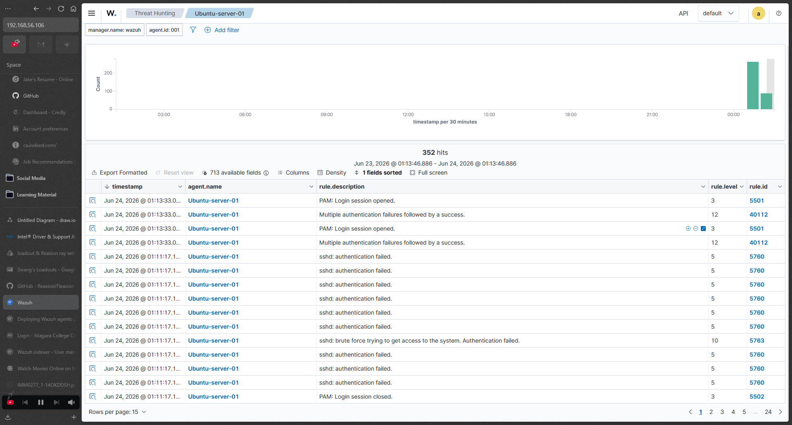

---

## Phase 6 - Suricata Deployment

Installed and configured Suricata IDS on Ubuntu Server.

Capabilities:

* Network traffic inspection
* Signature-based detection
* Event logging through eve.json

### Evidence

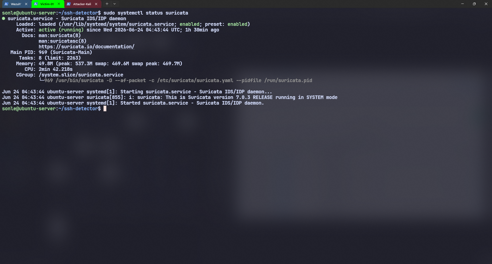

---

## Phase 7 - Incident Investigation

Performed analysis of detected events.

Investigated:

* Source IP addresses
* Event timestamps
* Alert signatures
* Attack timelines

Documentation:

* docs/incident-report.md

### Evidence

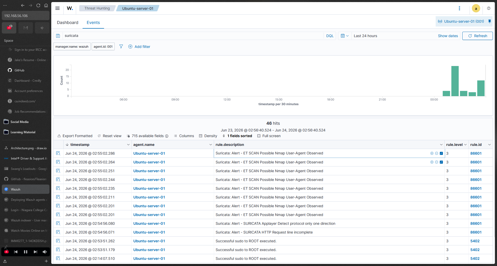

---

## Phase 8 - Custom Detection Engine

Developed a Python-based SSH attack detection engine.

### Detection Logic

Trigger an alert when:

* 3 or more failed logins occur
* A successful login follows within 3 minutes

### Workflow

auth.log

↓

Python Detection Engine

↓

JSON Alert

↓

Discord Notification

↓

Wazuh Visibility

### Evidence

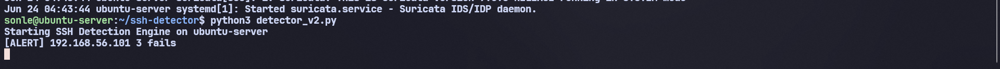

---

## Phase 9 - Discord Alerting

Implemented automated Discord notifications.

Alert Information:

* Hostname
* Source IP
* Severity
* Failed Login Count
* Timestamp

### Evidence

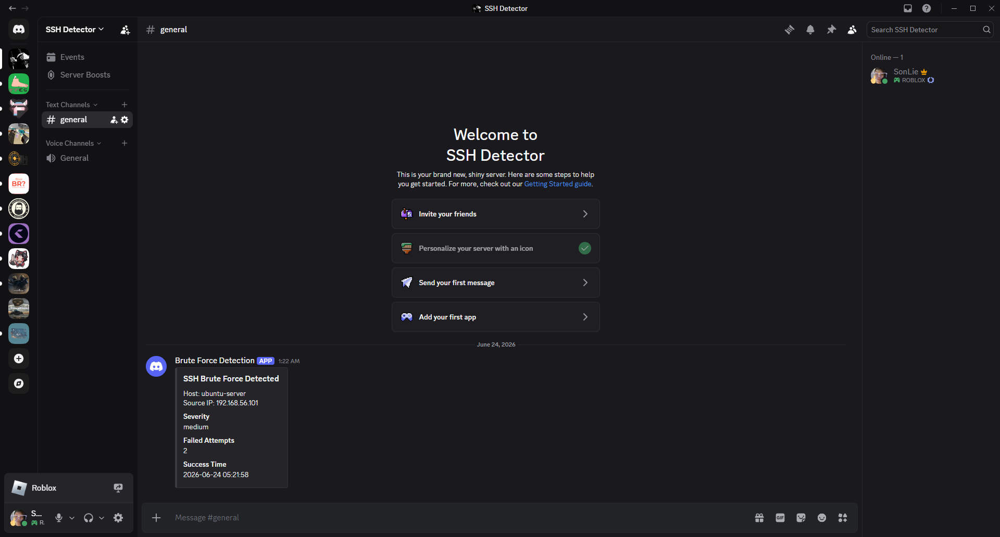

---

## Phase 10 - Automation with Systemd

Configured the detection engine as a Linux service.

Benefits:

* Auto-start on boot
* Automatic recovery after crashes
* Continuous monitoring

### Evidence

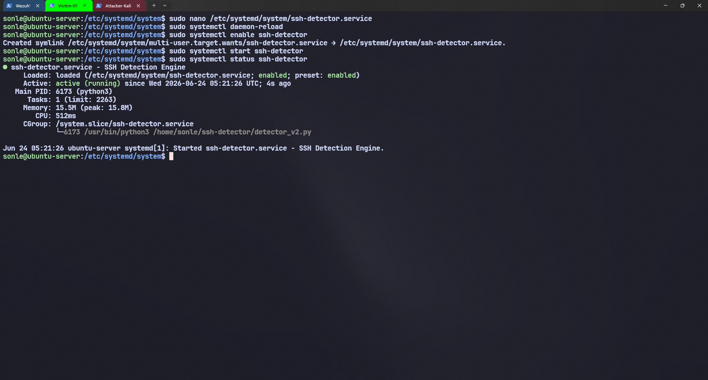

---


## Phase 11 - Automated Response with Fail2Ban

Implemented automated threat response.

Configuration:

* 3 failed login attempts
* 3-minute detection window
* 1-hour IP ban

### Response Workflow

Attack Detected

↓

Fail2Ban

↓

IP Blocked

↓

Event Logged


### Evidence

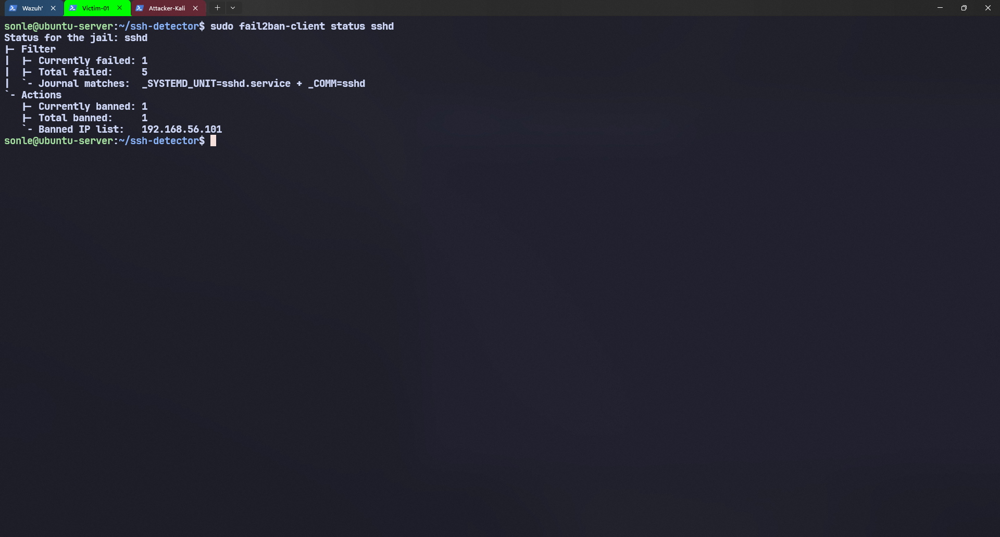

---

## Phase 12 - Architecture Documentation

Created architecture and workflow documentation.

### Evidence

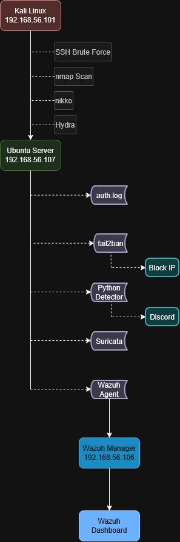

---

## Custom Detection Engine

Location:

```text
custom-detector/ssh-detector.py
```

Core Functions:

* Real-time log monitoring
* SSH attack detection
* Alert correlation
* JSON event generation
* Discord integration

Sample Alert:

```json
{
  "event_type": "ssh_bruteforce_success",
  "severity": "medium",
  "hostname": "ubuntu-server",
  "source_ip": "192.168.56.101",
  "failed_attempts": 7,
  "success_time": "2026-06-22T21:04:10"
}
```

---

## Project Structure

```text
wazuh-soc-homelab
│
├── README.md
├── .gitignore
│
├── custom-detector
│   ├── ssh-detector.py
│   ├── requirements.txt
│   └── sample_alerts.json
│
├── docs
│   ├── Architecture.png
│   ├── incident-report.md
│   └── lessons-learned.md
│
└── screenshots
    ├── 01-lab-setup.png
    ├── 02-agent-connected.png
    ├── 03-auth-log-ingestion.png
    ├── 04-nmap-detection.png
    ├── 05-bruteforce-failures.png
    ├── 06-suricata-running.png
    ├── 07-alert-details.png
    ├── 08-custom-detector.png
    ├── 09-discord-alert.png
    ├── 10-systemd-service.png
    └── 11-fail2ban-ban.png
```

---

## Skills Demonstrated

### Security Operations

* Security Monitoring
* Alert Triage
* Incident Investigation
* Threat Detection

### Blue Team Operations

* Log Analysis
* SIEM Administration
* IDS Monitoring
* Event Correlation

### Security Engineering

* Detection Engineering
* Security Automation
* Alerting Workflows
* Threat Response

### Infrastructure

* Linux Administration
* Virtualization
* Network Configuration
* Service Management

---

## Future Improvements

Planned enhancements:

* Windows Endpoint Monitoring
* Sysmon Integration
* Sigma Rules
* Threat Intelligence Feeds
* Active Response Scripts
* Email Alerting
* Dashboard Customization
* YARA Integration

---

## Lessons Learned

Key takeaways from this project:

* Suricata provides significantly better network visibility when integrated with Wazuh.
* Custom detection logic can identify attack patterns that may not exist in default SIEM rules.
* Automated alerting improves incident response time.
* Fail2Ban provides an effective first layer of containment against brute-force attacks.
* Proper network segmentation is important when building virtual SOC environments.

---

## Author

Lê Sinh Sơn

Computer Engineering Technician

Niagara College

Cybersecurity | SOC Operations | Detection Engineering
